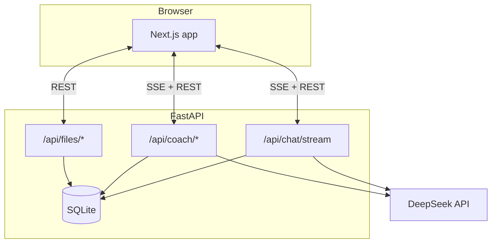
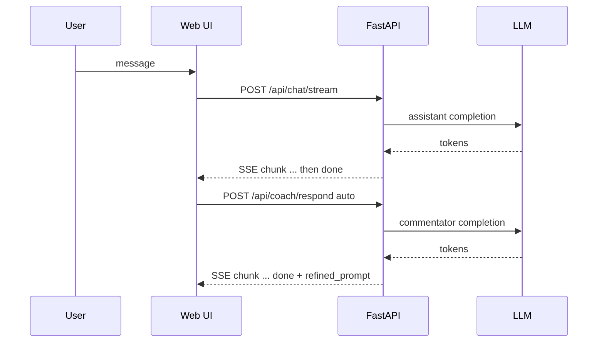

# Averroes · Prompt coaching for LLM chat

**Self-hosted web UI:** main assistant chat plus a **Commentator** side panel that reacts after each reply and proposes a **sharpened prompt**. Optional **0→1 workshop** walks from a vague idea to one polished prompt before normal chat. Attach PDF, DOCX, or TXT so both models see extracted text.

Stack: **Next.js**, **FastAPI**, **SQLite** (FTS5 search), **SSE** streaming, **DeepSeek** via an OpenAI-compatible API (bring your own key).

> **Warning:** Put `DEEPSEEK_API_KEY` only on the server (`backend/.env`). Never commit keys or put them in the frontend bundle.

**Try it:** [averroes-llm.vercel.app](https://averroes-llm.vercel.app) (hosted demo; this repo is for running your own copy).

---

## What it does

1. You chat with an assistant like usual (streaming tokens).
2. After each assistant reply, a **second** model call (the Commentator) reads the exchange and returns a short critique plus a **refined prompt** you can paste back into the main box.
3. In **workshop** mode, the first turns go through a dedicated dialogue whose job is to land **one** strong prompt, then you continue in normal chat.

So the product loop is: write prompt → get answer → get coached → optionally swap in a better prompt → better next answer.

---

## Who it is for

- Builders and power users who already hit **lazy or generic answers** when the ask was underspecified.
- Teams prototyping **prompt-heavy workflows** and wanting a UI pattern they can fork (not a hosted black box).
- Anyone who wants **file-grounded** coaching (upload a doc; coach + assistant both see a text preview in context).

---

## Why it is different

| Typical chat UI | Averroes |
|-----------------|----------|
| One model, one thread | Two lanes: assistant + Commentator after each turn |
| You guess why the answer was weak | Panel names gaps and hands you a rewritten prompt |
| Blank prompt bar for hard tasks | Workshop mode structures the path from fuzzy idea to concrete prompt |
| Keys in many SaaS dashboards | **Self-hosted**: SQLite on disk, one LLM provider config you control |

This is **not** RAG-as-a-product or an agent framework. It is **prompt quality as the feature**: critique + rewrite + optional workshop, with clear SSE APIs if you want to replace the UI later.

---

## Before / after (concrete)

**You send (weak):**

```text
write something about rust
```

**Assistant might answer** with a shallow overview because the task is undefined.

**Commentator aims at a tighter instruction**, for example:

```text
Draft a 250-word explanation of Rust's ownership and borrow checker for a programmer who knows C++. Include: (1) what problem they solve, (2) one analogy, (3) one common compile error novices hit. No installation steps.
```

Same underlying model family: clearer constraints usually produce **more useful** completions. The UI exists to surface that rewrite without leaving the thread.

---

## Architecture (two-model loop)



**One exchange end-to-end:**



More detail (SSE `type` fields, workshop routing): [`docs/ARCHITECTURE.md`](docs/ARCHITECTURE.md).

---

## 60-second quickstart

Prereqs: **Python 3.11+**, **Node 20+**, a [DeepSeek](https://platform.deepseek.com/) API key.

**1. Backend**

```bash
cd backend
python -m venv .venv && source .venv/bin/activate   # Windows: .venv\Scripts\activate
pip install -r requirements.txt
cp .env.example .env
```

Put your key in `backend/.env`:

```bash
echo 'DEEPSEEK_API_KEY=sk-your-key-here' > .env
# or edit .env by hand; keep FRONTEND_URL=http://localhost:3000 for local
```

Start API:

```bash
uvicorn app.main:app --reload --port 8000
```

**Expected:** lines like `Uvicorn running on http://127.0.0.1:8000` and `Application startup complete`.

**2. Frontend** (new terminal)

```bash
cd frontend
npm install
cp .env.example .env.local
```

Default `.env.local` already targets `http://localhost:8000`. Start UI:

```bash
npm run dev
```

**Expected:** Next prints a **Local** URL, usually `http://localhost:3000`.

**3. Sanity check**

```bash
curl -s http://localhost:8000/api/health
```

**Expected:**

```json
{"status":"ok","service":"averroes"}
```

**4. Use it**

Open [http://localhost:3000](http://localhost:3000). Start a conversation, send any message, wait for the assistant stream to finish, then read the **Commentator** panel on the side for the refined prompt line.

If something fails: confirm `.venv` is activated, port **8000** is free, and `DEEPSEEK_API_KEY` has no quotes or spaces.

---

## Configuration (beyond the quickstart)

### Backend (`backend/.env`)

| Variable | Required | Meaning |
|----------|----------|---------|
| `DEEPSEEK_API_KEY` | Yes | Server-side LLM auth |
| `FRONTEND_URL` | Production | CORS origin for your UI |
| `DB_PATH` | No | SQLite path (default `averroes.db`) |
| `DEBUG` | No | Verbose logs if `true` |

See `backend/.env.example` for models, rate limits, uploads.

### Frontend (`frontend/.env.local`)

| Variable | Meaning |
|----------|---------|
| `NEXT_PUBLIC_API_URL` | FastAPI base URL, **no** trailing slash (default local: `http://localhost:8000`) |

---

## Repository layout

| Path | Role |
|------|------|
| `backend/app/routers/` | Chat, coach, workshop, conversations, files, spaces |
| `backend/app/prompts/` | Assistant + coach system prompts |
| `backend/app/services/llm.py` | Streaming DeepSeek client |
| `frontend/lib/api.ts` | Typed HTTP + SSE parsing |
| `frontend/components/` | Chat, commentator panel, sidebar |

---

## OpenAPI

`/docs` and `/openapi.json` are on by default. Fine for dev; on a public host you may disable them in `backend/app/main.py` (`docs_url=None`, `openapi_url=None`).

---

## Deploy (outline)

1. Run FastAPI where SSE stays open (container or VM).
2. Set `DEEPSEEK_API_KEY` and `FRONTEND_URL` to the real UI origin.
3. Deploy Next.js with `NEXT_PUBLIC_API_URL` pointing at that API.

`backend/railway.json` and `frontend/vercel.json` are starter configs only.

---

## GitHub metadata (copy-paste)

Set these on the repo **About** box so search and browse classify the project.

**Short description (350 chars max):**

```text
Open-source prompt-coaching chat UI: Commentator panel + refined prompts after each reply, 0→1 workshop mode, file-aware context. Next.js, FastAPI, SQLite, DeepSeek. Self-hosted.
```

**Topics / tags (suggested):**

```text
prompt-engineering, llm, large-language-models, chat-ui, ai-assistant,
fastapi, nextjs, typescript, python, deepseek, sse, server-sent-events,
sqlite, self-hosted, coaching, human-in-the-loop
```

Pick **5 to 10** topics GitHub allows; keep the first ones highest signal.

---

## Contributing

Pull requests welcome. Do not commit `.env`, `.env.local`, or live keys. Extend `*.example` when you add settings.

---

## License

[MIT](LICENSE)
