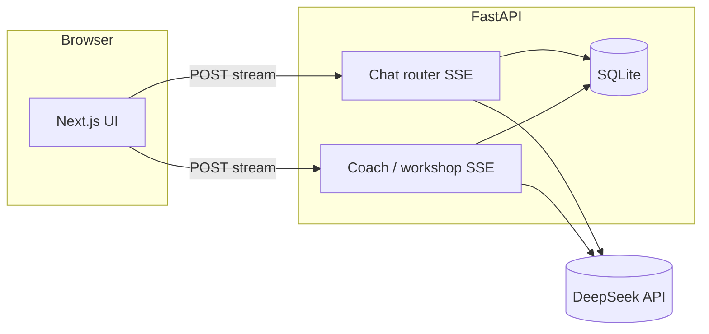

# Averroes · Prompt coaching for LLM chat

**Subtitle for search:** open-source **prompt coaching** web app: a second model (**The Commentator**) reviews each exchange and proposes sharper prompts; optional **0→1 workshop** for shaping an idea before normal chat; **PDF / DOCX / TXT** context for both sides.

---

## What it does

You chat with an assistant as usual. After each reply, **The Commentator** runs as a **separate** model call: it reads the thread (and any uploaded docs), notes what was fuzzy or underspecified, and outputs a **cleaned-up prompt** you can paste back into the main box.

**Workshop mode** front-loads a short back-and-forth whose goal is **one** strong prompt, then you switch to regular chat with that foundation.

Everything streams over **SSE**. Stack: **Next.js** UI, **FastAPI** API, **SQLite** (+ FTS search), **DeepSeek** via an OpenAI-compatible HTTP API (bring your own key).

---

## Who it is for

- People who already use chat LLMs but want **tighter prompts** without switching to a separate “prompt generator” tool  
- Builders who want a **forkable** reference for dual-stream UX (main chat + coach)  
- Anyone evaluating **prompt refinement loops** with **local or self-hosted** data (SQLite, no vendor lock-in on storage)

---

## How it is different

| Typical chat UI | Averroes |
|-----------------|----------|
| One model, one thread | Main model **plus** an observer model on a **schedule you define in code** (here: after each assistant turn) |
| You alone fix vague prompts | The Commentator **names gaps** and emits a **rewrite**, not just encouragement |
| Single-shot “improve my prompt” widgets | **Workshop** keeps context in-thread until a prompt is ready; attachments feed **both** models |

This is **not** a general “ChatGPT wrapper”: persistence, coach prompts, and SSE contracts are **first-class** in the repo ([`docs/ARCHITECTURE.md`](docs/ARCHITECTURE.md)).

---

## Live demo

**[averroes-llm.vercel.app](https://averroes-llm.vercel.app)** (hosted build; API is operated by the deployer).

---

## See it (product, not only code)

| Asset | Status |
|-------|--------|
| **Screenshots** | Add files under [`docs/images/`](docs/images/) and uncomment the image lines below |
| **Architecture (diagram)** | Mermaid diagram under [System sketch](#system-sketch) |
| **Before / after** | [Concrete example](#concrete-example-study-notes) |

<!-- Uncomment after adding images:


-->

**Suggested extras:** a short terminal recording (asciinema or GIF) of install + first message, or a Loom-style walkthrough linked from your repo **About** section.

---

## 60-second quickstart

Assumes **Python 3.11+**, **Node 20+**, and a **[DeepSeek API key](https://platform.deepseek.com/)**. Run from the **repository root**.

**1. Backend**

```bash
cd backend
python -m venv .venv
source .venv/bin/activate   # Windows: .venv\Scripts\activate
pip install -r requirements.txt
cp .env.example .env
```

**Expected:** `pip` finishes with `Successfully installed ...` (versions vary).

Edit `backend/.env` and set:

```bash
DEEPSEEK_API_KEY=your_real_key_here
```

**2. Start API**

```bash
uvicorn app.main:app --reload --port 8000
```

**Expected (last line similar to):**

```text
INFO:     Uvicorn running on http://127.0.0.1:8000 (Press CTRL+C to quit)
```

Quick check:

```bash
curl -s http://127.0.0.1:8000/api/health
```

**Expected:**

```json
{"status":"ok","service":"averroes"}
```

**3. Frontend (new terminal, repo root)**

```bash
cd frontend
npm install
cp .env.example .env.local
npm run dev
```

**Expected:** Next prints **Local:** `http://localhost:3000`.

Open **http://localhost:3000**, start a conversation, send a message. You should see the main reply stream, then the **commentator** panel activity after the assistant finishes.

---

### Concrete example: study notes

**You send (main chat):**

```text
summarize machine learning for me
```

**Typical gap:** no audience, depth, format, or constraints.

**What The Commentator is aimed at producing (illustrative refined prompt you might paste back):**

```text
Assume I'm an undergrad who knows Python and linear algebra but not ML jargon.
Explain supervised vs unsupervised learning with one concrete example each.
Keep it under 300 words; use short headings; no hype about AI replacing jobs.
```

Your live wording will differ; the point is **constraints + audience + shape**, not a generic summary request.

---

## System sketch



Keys stay on the server; the browser only holds `NEXT_PUBLIC_API_URL` (no secrets).

---

## Warning

Self-hosting requires **`DEEPSEEK_API_KEY`** in **`backend/.env`**. Never commit `.env` or `.env.local`. Never put provider keys in `NEXT_PUBLIC_*` vars.

---

## Configuration (reference)

### Backend (`backend/.env`)

| Variable | Required | Meaning |
|----------|----------|---------|
| `DEEPSEEK_API_KEY` | Yes | Outbound LLM auth |
| `FRONTEND_URL` | Production | CORS origin for your UI |
| `DB_PATH` | No | SQLite path (default `averroes.db`) |
| `DEBUG` | No | Verbose logs if `true` |

More options: `backend/.env.example`.

### Frontend (`frontend/.env.local`)

| Variable | Meaning |
|----------|---------|
| `NEXT_PUBLIC_API_URL` | FastAPI base **without** trailing slash (default dev: `http://localhost:8000`) |

---

## Repository layout

| Path | Role |
|------|------|
| `backend/app/routers/` | Chat, coach, workshop, conversations, files, spaces |
| `backend/app/prompts/` | Assistant + coach system prompts |
| `backend/app/services/llm.py` | Streaming DeepSeek client |
| `frontend/lib/api.ts` | HTTP + SSE client |
| `frontend/components/` | Chat, commentator panel, sidebar |

Details: [`docs/ARCHITECTURE.md`](docs/ARCHITECTURE.md) (SSE event types, workshop completion).

---

## OpenAPI

`/docs` and `/openapi.json` are on by default. To hide them on a public host, set `docs_url=None` and `openapi_url=None` on `FastAPI(...)` in `backend/app/main.py` (or gate on env).

---

## Deploy (outline)

1. Run FastAPI somewhere that tolerates long-lived SSE connections.  
2. Set `DEEPSEEK_API_KEY` and `FRONTEND_URL` to your real UI origin.  
3. Deploy Next.js with `NEXT_PUBLIC_API_URL` pointing at that API.

See `backend/railway.json` and `frontend/vercel.json` as starters (no secrets).

---

## GitHub metadata (copy-paste)

Set these on the repo **About** cog so discovery matches what this actually is.

**Short description (GitHub “Description” field):**

```text
Open-source prompt coaching for LLM chat: dual-stream UI with The Commentator + 0→1 workshop, Next.js, FastAPI, SQLite, DeepSeek.
```

**Topics (suggested):**

```text
prompt-engineering, llm, llm-ui, ai-chat, coaching, nextjs, fastapi, typescript, python, deepseek, server-sent-events, sqlite, self-hosted, prompt-refinement
```

---

## Contributing

Pull requests welcome. Do not commit secrets; extend `*.example` when you add configuration.

---

## License

[MIT](LICENSE)
